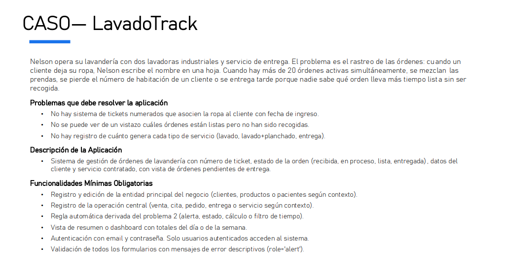
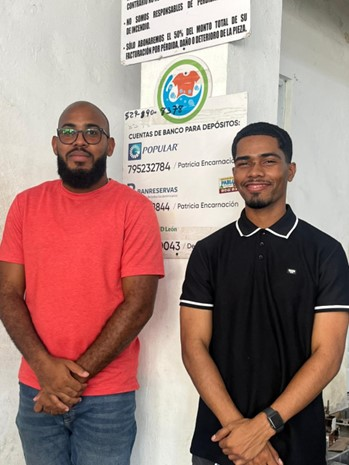
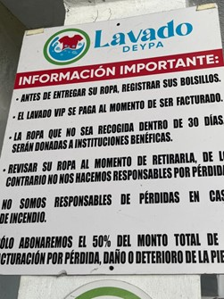
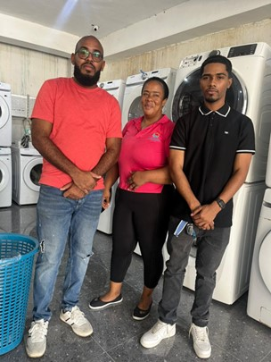
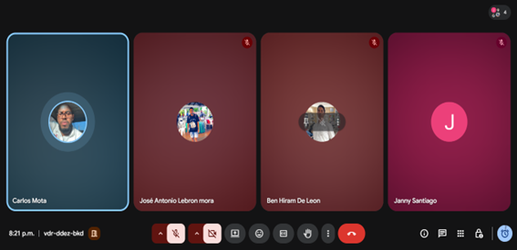
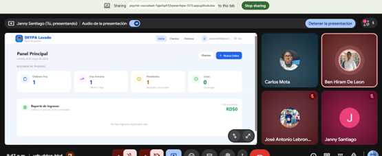

# Proyecto Final - LavadoTrack

### **Integrantes:**
Janny Santiago – 100673781

Carlos Mota – 100408999

Ben De Leon – 100487243

José Lebron - 100467938

### **Materia**

Leng. De Programación III

### **Maestro**
Edian Franco De los Santos

 
## ACTA DE INICIO — LavadoTrack (Deypa-Lavado)
Fecha: Mayo 2026

Identificación del Negocio Real

Nombre: Deypa-Lavado
Sector: Los mina  

Ubicación: Av. Santa Luisa #113, Santo Domingo este, República Dominicana 

### **Descripción operativa:** 
Deypa-Lavado es un negocio dedicado al lavado, secado y planchado de ropa para clientes particulares. Actualmente opera sin un sistema digital, lo que genera desorden en el seguimiento de órdenes y pérdida de prendas sin reclamar.

### **Validación de Requisitos**
Los requisitos del sistema fueron definidos mediante análisis del flujo de trabajo típico de una lavandería, observando cómo se registran las órdenes, el seguimiento de prendas y el control de entregas. Además, se identificaron necesidades relacionadas con organización, rapidez de acceso a información y generación de reportes operativos para mejorar la eficiencia del negocio.

### **Problema que Resuelve**
La aplicación busca resolver la desorganización en el control de órdenes, clientes y estados de entrega dentro de una lavandería. Actualmente, el manejo manual puede provocar pérdida de información, retrasos en entregas y dificultad para controlar ingresos y servicios realizados. El sistema permitirá centralizar y automatizar el registro de órdenes, seguimiento y reportes operativos.

### **Objetivo General**
Desarrollar una aplicación web que permita a negocios de lavandería gestionar clientes, órdenes y reportes de ingresos de forma digital, eficiente y en tiempo real.

### **Objetivos Específicos**
1. Implementar un módulo de autenticación y gestión de clientes que permita registrar, editar, listar y eliminar clientes de forma segura mediante Firebase Auth y Firestore.
2. Desarrollar un módulo de administración de clientes para almacenar y consultar información de los usuarios del servicio.
3. Crear un panel de control con reportes y alertas visuales que faciliten el seguimiento de ingresos, órdenes pendientes y órdenes listas para entrega.

#### Usuarios de la Aplicación

Usuario primario — Administrador/Empleado de lavandería
Persona encargada de registrar órdenes, actualizar estados y gestionar clientes. Posee conocimientos técnicos básicos en el uso de computadoras y aplicaciones web.

Usuario secundario — Propietario del negocio
Responsable de supervisar ingresos, flujo de trabajo y rendimiento operativo. Tiene conocimientos básicos o intermedios sobre sistemas digitales y reportes administrativos.

#### Fuera del Alcance
1. Notificaciones automáticas al cliente (WhatsApp/SMS): No se implementa porque requiere integración con APIs de terceros (Twilio, WhatsApp Business) que están fuera del alcance técnico del proyecto académico.
2. Pagos en línea: No se incluye procesamiento de pagos porque el negocio cobra en efectivo en el mostrador y no existe un flujo de pago digital en su operación actual.
3. Aplicación móvil nativa: La app es web responsive, pero no se publica como app en App Store o Google Play, lo cual requeriría React Native u otra tecnología adicional.

## Integrantes del grupo y roles

#### Carlos – Desarrollo frontend y diseño de interfaz (UI/UX).
#### Jose – Gestión de base de datos (Supabase).
#### Ben – Desarrollo del módulo de órdenes y lógica del sistema.
#### Janny – Desarrollo del dashboard, reportes y pruebas del sistema.

   

 
 
Link: https://github.com/motacismael/LavadoTrack.git

